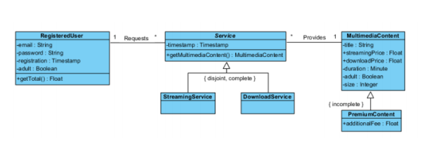
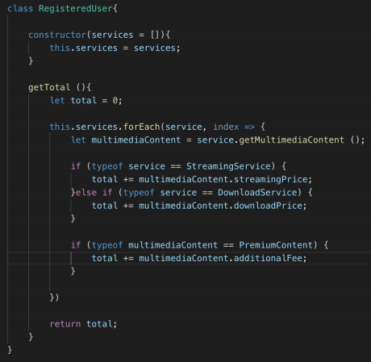
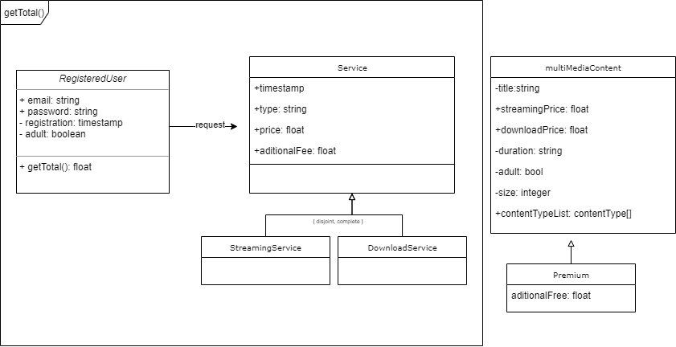

# Frontend-test-AXPE

## Exercise 1

Problemas:




1 - Uno de los problemas que podria traer realizar condicionales especificos (hard-coded) a futuro, es que si en algun momento se cambia el nombre del servicio (a por ejemplo en vez de llamarse StreamingService, se llama StreamingContent) fallaran estos campos y no se tomara en cuenta el valor del servicio aunque aun exista y tenga un valor, teniendo que aplicar este cambio en todas las capas involucradas

2- El precio no viene incluido en el servicio, si no que se debe consultar al contenido multimedia, esto podria traer problemas a futuro si se implementaran diferentes condiciones un contenido ( contenido en rebaja, que puede ser temporal), al momento de hacer el calculo, puede que la consulta nos devuelva un precio distinto al que realmente pago el usuario

3- el valor añadido va condicionado al tipo de contenido, dado que el campo es aditionalFee, si se quisiera añadir mas de un tipo de contenido (Premium, Exclusivo, etc...) que tiene un valor añadido, habra que hacer multiples condicionales para poder sumar el mismo campo

El enunciado ya menciona que el codigo es pseudocodigo, pero en el esquema UML presentado antes, no incluye se incluye el tipo en la clase de servicio, el typeof en este caso podria prestarse a confusion

Soluciones:



 ```js
  class RegisteredUser{
      constructor(service = []){
          this.services = services;
      }

      getTotal (){
        return this.services.reduce((total, service) => {
            const servicePrice = service.contentPrice;
            
            if(service.hasOwnProperty('aditionalFee')){
                servicePrice += service.aditionalFee
            }

            return total + servicePrice
        })
      }
  }
    
```

1 - dado que ya se incluye el tipo en cada objeto del servicio, con el timestamp (que se da a entender que es del momento en el que se contrato por el servicio), no hace falta mirar que tipo es cada servicio contratado, ya que a fines del calculo total solo nos interesa el precio, si a futuro quisieramos filtrar por tipos se podria implementar

2- El precio viene incluido en el servicio, y tendremos el precio exacto en el que se pago en su momento por el contenido (podria resultar util a futuro si se quiere mostrar cual fue el importe adicional)

3- el valor añadido va incluido en el objecto servicio, teniendo asi el valor añadido del momento en el que se hizo el pago, sin tener que consultar al servicio multimedia con el riesgo de que las condiciones del contenido hayan cambiado

## Exercise 2
Ir a /maps-watcher
* [React Marker Demo](maps-watcher/README.md)
